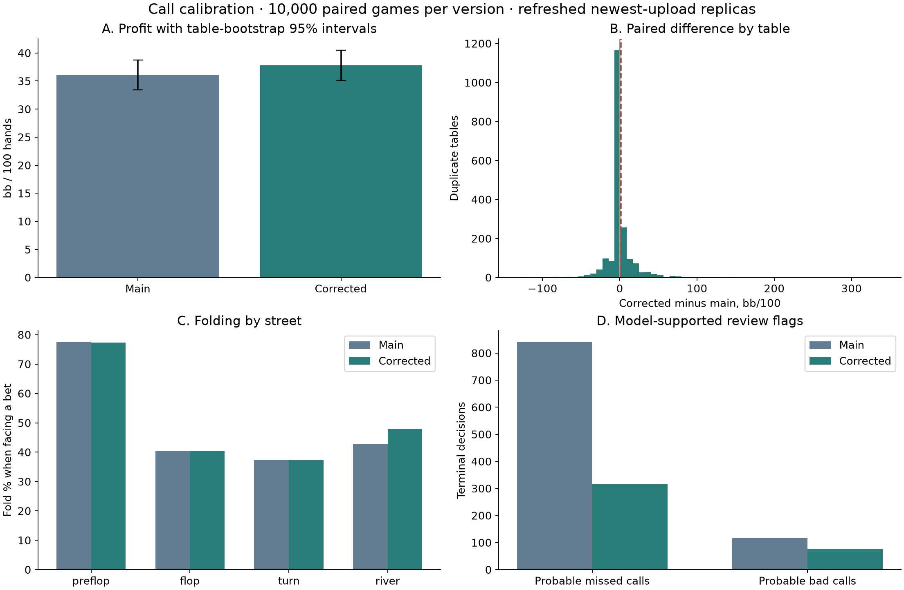

# Call calibration: main versus corrected bot — 4 October 2026

The held-out comparison played **10,000 games per version** (2,000,000 hands total) against 61 refreshed opponent replicas. The corrected bot changed return by **+1.70 [+0.78, +2.67] bb/100** (paired 95% table-bootstrap interval).

The interval supports an improvement in this simulated field. This comparison uses the same tables, decks and seat rotations. It is not a live tournament result.

| Metric | Main | Corrected bot |
| --- | ---: | ---: |
| Net chips | +721,342 | +755,369 |
| bb/100 [95% interval] | +36.07 [+33.41, +38.72] | +37.77 [+35.13, +40.51] |
| Folds / hands | 82.53% | 82.53% |
| Negative games | 3,996 | 3,968 |
| Mean game placement points | 3.315 | 3.324 |
| Mean duplicate-table placement points | 3.637 | 3.657 |
| Duplicate tables won outright | 27.54% | 28.79% |
| Probable missed terminal calls | 840 | 316 |
| Missed-call flags / terminal folds | 6.27% | 2.34% |
| Probable bad terminal calls | 116 | 76 |
| Bad-call flags / terminal calls | 0.84% | 0.55% |
| Provably avoidable folds | 0 | 0 |
| All-in runout difference, chips | +4,512.1 | -4,240.7 |
| Player failures | 0 | 0 |

The paired change in duplicate-table placement points was +0.0193, with a 95% interval [-0.0015, +0.0402]. Points follow the tournament's rank and tie rules. Placement means weight duplicate tables equally; chip return weights games equally. This is a table-level comparison; it does not simulate four-round regrouping or establish a podium probability.

## Changes and selection

Preflop: a tracked-range equity estimate can justify a hand outside QQ+/AK when calling ends all betting. The normal equity margin still applies; random-card estimates retain the previous safeguards.

Sparse equity: at 32–127 Monte Carlo samples, a conservative lower bound can rescue a terminal call. The bound allocates a 1% error budget across sample counts; it permits calls but never a raise from a sparse estimate. This addresses the reviewed full-house fold after 104 winning samples without treating one or two winning samples as sufficient evidence.

The independent 500-game pilot compared main, these core fixes, and the fixes plus a tracked-range river call margin of 0.06 instead of 0.02. Pilot chip totals were +37,310 for main, +39,221 for the core fixes, and +40,849 with the tighter river margin; the predeclared selection rule chose `snapshots/call_calibration_river`. The 10,000-game comparison used a different seed and did not select additional parameters. It measures the combined policy change; it does not isolate each correction's contribution.

Sparse-estimate diagnostics: main {'sparse_estimates': 51, 'accepted_bounds': 0, 'calls': 0}; corrected bot {'sparse_estimates': 36, 'accepted_bounds': 0, 'calls': 0}. The regression test reproduces the earlier full-house failure. A rare event may not recur in this run.

## Opponent refit and coverage

The frozen snapshot has 2,482,468 records, 2,488 replays and 2,497 metadata matches. 9 metadata matches lack replays and are explicitly listed. Coverage checks retained all 441,580 newest-version actions, including 60 upload games. Every timestamped validation against house:call marks a new version regardless of verdict. Display names remain separate identities, as recorded in the input metadata.

29 non-house identities lack a usable trusted upload boundary/data and remain excluded. The exact reasons and identities are listed in upload-selection.json; they are not silently assigned a newest version.

Sparse parameters borrow from earlier uploads at maximum weight 0.1^version_age × 2^(−upload_gap_hours/6), only up to their effective support target. 66/620 estimates remain below target. These targets and time discounts are modeling choices, not guarantees of replica accuracy. All newest observations retain weight one.

Newest uploads without any replay are included using prior data only: poke-bowl, yep. Their newest behavior has not been observed; their historical rows keep the full age/time discount and their estimates remain explicitly uncertain.

| Prior-only opponent at table | Paired games | Corrected − main, bb/100 [95% interval] |
| --- | ---: | ---: |
| No | 8,673 | +1.73 [+0.71, +2.82] |
| Yes | 1,327 | +1.51 [-0.26, +3.22] |

These cohorts check sensitivity to the two unobserved newest submissions; different table compositions prevent a causal comparison between cohorts.

The refreshed fit selected a history-sizing mixture weight of 0.75; patterns were selected using whole-game validation splits, then runtime models were refitted on all newest data. The field is not an independent sample of unseen real opponents.

## Decision audit and remaining weaknesses

Every simulated hand was reconstructed to verify legal actions, pots, payouts and zero-sum chip totals. Every terminal call/fold and heads-up postflop call/fold was audited. Probable terminal flags require agreement across tight/loose public-range models and the applicable wide-shover sensitivity, after a 95% Monte Carlo margin and a 2-chip threshold. Those margins exclude model error and have no multiple-testing correction; flags are review candidates, not known optimal-action labels.

Counts compare complete policies on the same initial deals. Changed actions can change later decisions and opponent learning, so the two versions need not encounter identical decision opportunities.

| Street | Main: fold when facing a bet | Corrected: fold when facing a bet |
| --- | ---: | ---: |
| Preflop | 77.43% | 77.35% |
| Flop | 40.54% | 40.53% |
| Turn | 37.41% | 37.31% |
| River | 42.73% | 47.78% |

| Street | Main missed calls | Corrected missed calls | Main bad calls | Corrected bad calls |
| --- | ---: | ---: | ---: | ---: |
| Preflop | 782 | 216 | 0 | 1 |
| Flop | 35 | 40 | 3 | 2 |
| Turn | 6 | 7 | 7 | 6 |
| River | 17 | 53 | 106 | 67 |

The largest reduction in missed-call flags was preflop (782 to 216). On the river, bad-call flags fell from 106 to 67, while missed-call flags rose from 17 to 53. The tighter river policy therefore merits further calibration. These are model-based counts of different encountered decisions, not a causal value estimate for each change.

Negative games with a terminal flag: main 314/3,996; corrected 167/3,968. A losing game alone does not establish a strategic error. The all-in runout difference uses hidden cards retrospectively and does not remove all poker variance.

The main remaining risks are miscalibrated opponent ranges, sparse/new submissions, and the tradeoff between reducing river overcalls and creating missed calls. The compressed audits retain street-level cases; the accompanying blunder CSV makes all probable/certain flags reviewable.

## SWOT

- **Strengths:** the two reviewed terminal-call failures have regression coverage; all 20,000 simulated games completed with legal actions and balanced payouts. The held-out return interval supports an improvement against this replica field.
- **Weaknesses:** the corrected policy still has 316 probable missed terminal calls and 76 probable bad terminal calls. Range calibration remains a source of error; these model-based flags require review.
- **Opportunities:** review the exported high-cost call/fold cases by street and opponent, then validate targeted range or sizing changes on a new held-out seed before accepting them.
- **Threats:** 66/620 fitted estimates remain below support targets, two newest submissions lack replays, and replicas cannot reproduce all hidden-state behavior. Live upload changes, clock pressure and tournament regrouping can change performance.

## Compute, verification and reproduction

Baseline main: `6cfdf0f44b332933d88d440791e7151028061849`. The baseline snapshot contains identical strategy/parameters plus the same optional GPU batching hook. Fixed-sample CPU/CUDA parity passed 48 cases, and the fitted NumPy runtime matched its training models. The 120-game backend check took 11.87s on CPU versus 12.85s on CUDA including startup. Mean worker time per game was 1.094s CPU versus 0.984s CUDA. Amortizing that measured work over the complete study selected 12 cuda workers; this is an approximate throughput projection. The final 20,000 executions took 36.35 minutes. All four V100s performed simulation, fitting and the separate action audit. All 154 tests passed, including the reviewed-hand regression tests. A separate 120-game CPU check is recorded when simulation uses CUDA.

The separate CPU check played 120 games with no player failures; maximum candidate bank use was 5.96% and maximum action time was 91.33 ms.

Input actions SHA-256: `aa24a7cdad88692035f8e8ea8db22be0271b8667c96fd0344f0f78fe023b0b6d`. Exact plans, model evidence, checks and code hashes accompany the report. Wall-clock sampling can change outcomes between reruns even with fixed seeds. Audits can replay the stored traces with fingerprint checks.

[Reproduction commands](call-calibration-20261004-reproduce.md) · [Paired tables](call-calibration-20261004-tables.csv) · [Game reviews](call-calibration-20261004-games.csv) · [Blunder cases](call-calibration-20261004-blunders.csv) · [Parameters](call-calibration-20261004-parameters.csv)
