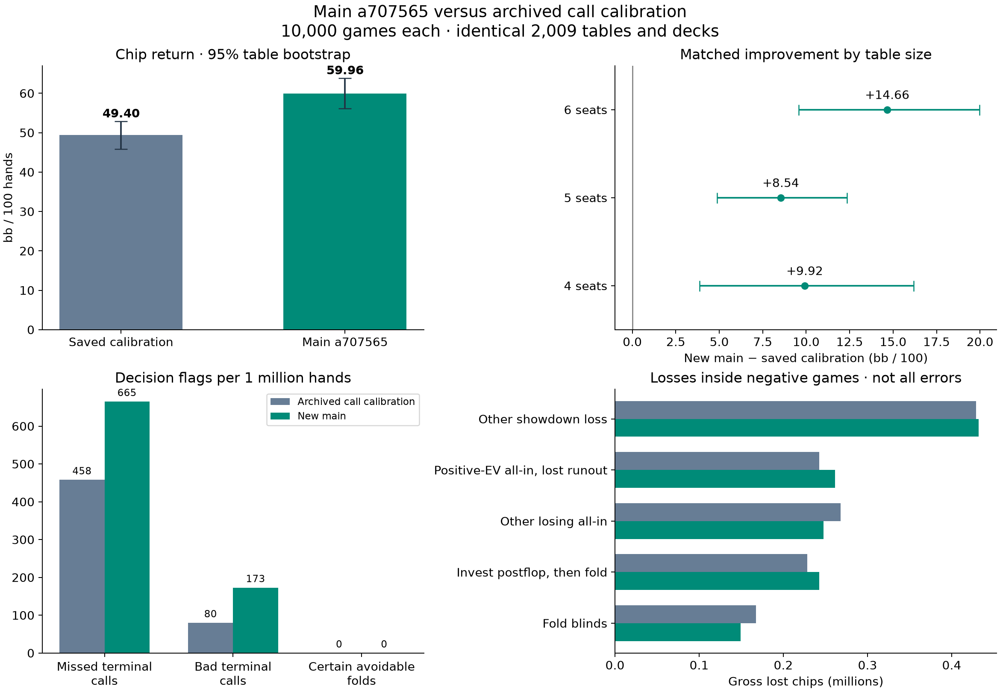
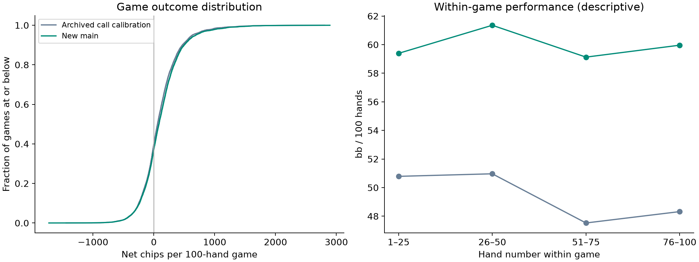

# New main versus saved call calibration — 4 October 2026

**New main (`a707565`) returned 59.96 bb/100 versus 49.40 for saved call calibration (`e186308`): a paired change of +10.56 [+7.86, +13.12] bb/100 (95% interval).** The matched replica study supports an improvement. Exactly **10,000 new games / 1,000,000 hands** were simulated; all 10,000 calibration games and their decision audits were read from the completed study, never rerun.

## Performance

| Metric | Saved call calibration | New main |
| --- | ---: | ---: |
| Net chips | 988,018 | 1,199,172 |
| bb/100 [95% table bootstrap] | +49.40 [+45.89, +52.89] | +59.96 [+56.15, +63.84] |
| Mean round placement points | 3.5657 | 3.7275 |
| Outright first in duplicate table | 25.34% | 31.91% |
| Negative 100-hand games | 3,959 (39.59%) | 3,710 (37.10%) |
| Hands folded | 835,546 (83.55%) | 818,014 (81.80%) |
| Fold when facing a bet | 73.262% | 70.934% |
| VPIP / preflop raise hands | 22.04% / 15.99% | 24.02% / 17.86% |
| Probable missed terminal calls | 458 | 665 |
| Probable bad terminal calls | 80 | 173 |
| Certain avoidable folds | 0 | 0 |
| Flagged folds / all folds | 0.055% | 0.081% |
| Missed-call flags / terminal folds | 2.554% | 3.438% |
| Bad-call flags / terminal calls | 0.425% | 0.881% |
| Player failures | 0 | 0 |

The placement-point change is **+0.16 [+0.10, +0.22] points per duplicate table**. Tournament scoring ranks chips within each game, then total game points within the duplicate set. Chip return and placement therefore measure different outcomes. This study models those duplicate tables, not the four-round regrouping or probability of a final podium finish.

Return here is total chips divided by total hands, converted to bb/100. The harness console averages table rates equally, so its headline can differ slightly when table sizes vary; the paired report uses equal game weights for both versions.

| Seats | Duplicate tables | Main bb/100 | Main − calibration [95% interval] |
| ---: | ---: | ---: | ---: |
| 4 | 517 | 58.40 | +9.92 [+3.88, +16.19] |
| 5 | 1020 | 57.37 | +8.54 [+4.87, +12.34] |
| 6 | 472 | 65.76 | +14.66 [+9.57, +19.97] |

## What changed in main

- Retains call-calibration safeguards: guaranteed shared royal-flush calls, conservative partial-sample terminal calls, and the 0.06 river call margin.
- Weights opponent ranges by bet size; small bets retain more bluff mass and large bets retain less.
- Opens any two cards when folded to the small blind; conditionally calls three-bets wider against a frequent three-bettor.
- Restricts out-of-position stabs after calling, adds in-position flop floats, and uses 1.4-pot air/draw bets in selected positions.
- Prices preflop all-ins against players already in the pot. The special proven-shover rescue also requires a top-range hand when others remain to act.

These changes were evaluated together. Differences below do not identify the causal contribution of any individual change; no ablation or retuning was performed. The frozen main source is byte-identical to its Git bot tree, with no GPU patch.

## Folds and decision weaknesses

Main folded 818,014 of 1,000,000 hands. The audit found 665 probable missed terminal calls and 0 certain avoidable folds, or 0.081% of all folds. This is an audited flag rate, not the true fraction of unnecessary folds: future betting, opponent-model errors and unexamined alternatives prevent that identification. A terminal call settles the hand without further betting.

| Street | Calibration missed / bad calls | Main missed / bad calls | Main terminal folds / calls |
| --- | ---: | ---: | ---: |
| preflop | 375 / 0 | 396 / 0 | 9,693 / 8,158 |
| flop | 27 / 3 | 90 / 0 | 927 / 902 |
| turn | 7 / 5 | 39 / 2 | 739 / 1,519 |
| river | 49 / 72 | 140 / 171 | 7,982 / 9,063 |

Preflop accounts for 396 of main's missed terminal calls; the river accounts for 171 of its bad terminal calls. Flagged-decision estimate contexts: {'tracked range estimate': 823, 'conservative sparse estimate': 2, 'uniform range estimate': 10, 'no accepted equity estimate': 3}. Of 390,790 recorded equity estimates, 34,185 stopped at the time budget and 212 were not accepted. These are diagnostic counts, not independent proofs of an error.

The public audit is identical for both versions: tight/loose ranges and an extra wide-shover sensitivity where observed history supports it. A probable missed call requires every tested model’s 95% Monte Carlo lower bound to exceed +2 chips; a probable bad call requires every upper bound below −2. Those intervals cover simulation noise within the models, not uncertainty about whether the ranges describe the opponent. The audit does not adopt main’s new bet-size priors, so disagreement can reflect either a bot error or a range-model disagreement. Hidden-card outcomes are kept as retrospective diagnostics.

### Reviewable examples

| Decision ID (zero-based hand) | Classification | Hole / board | Pot / call | Public call-EV bound | Hand / game chips | Estimate |
| --- | --- | --- | ---: | ---: | ---: | --- |
| `t000044-g2-c0:42:7` | probable_missed_terminal_call | Ks Kh / preflop | 430 / 173 | [177.31, 203.19] | -27 / -355 | conservative sparse estimate |
| `t001412-g3-c0:68:12` | probable_missed_terminal_call | Jh Js / Td Ah 8d 6h Jc | 247 / 154 | [100.89, 140.40] | -46 / 182 | tracked range estimate |
| `t000379-g1-c0:54:19` | probable_missed_terminal_call | 9c Ac / 6c 5h 9d 9s 8s | 243 / 181 | [98.47, 146.02] | -19 / 34 | tracked range estimate |
| `t001602-g0-c0:98:13` | probable_bad_terminal_call | Kd Qd / 8s Ah Th 4h 7c | 312 / 88 | [-87.60, -61.46] | -200 / 17 | uniform range estimate |
| `t001454-g2-c0:83:11` | probable_bad_terminal_call | 5d 5h / 9h 8d 3h 9s 3s | 250 / 151 | [-130.52, -56.12] | -200 / 233 | tracked range estimate |
| `t001193-g3-c0:41:12` | probable_bad_terminal_call | As Th / 5h 8s Jh 6d 9s | 297 / 99 | [-88.22, -49.34] | -197 / -306 | tracked range estimate |

The complete blunder CSV retains every flagged action, the bot’s equity estimate and sample count. Public EV is incremental call versus fold; it is not the hand’s final profit and cannot simply be added to the tournament score.

Public-state replay explains the selected decisions without rerunning a bot:

- `t000044-g2-c0:42:7` (Ks Kh): the engine stopped after 46 samples with raw equity 52.17%. The conservative partial-sample bound reduced this to 15.63%, below the 31.69% call threshold, despite 33.6 seconds remaining in the game bank. The per-decision budget, rather than an exhausted bank, constrained this estimate. A larger budget for expensive terminal decisions is a targeted opportunity; sparse-estimate flags are rare overall.
- `t001412-g3-c0:68:12` (Jh Js): the fully sampled tracked range gave 42.06% equity, below the 46.40% call threshold. The public sensitivity models instead put incremental call EV above +100.89 chips. This points to range calibration and margin interaction; it was not a missing-equity fallback.
- `t001602-g0-c0:98:13` (Kd Qd): the opponent had shoved preflop 47 times in 99 observed hands. Main therefore treated its range as random cards even after postflop betting. It accepted 29.56% equity against a 29.14% threshold. This is a concrete weakness in transferring a preflop shover read to later streets: postflop actions should still inform that opponent’s range.
- `t001454-g2-c0:83:11` (5d 5h): the fully sampled tracked range gave 46.68% equity and crossed the 45.66% call threshold. All public sensitivity models put call EV below -56.12 chips. Together with the folded strong hand above, this argues for reviewing range calibration by bet size and action history, rather than applying one global call-margin change.

### Additional structural weaknesses and observed tactics

**Bluff gate does not scale with size.** Main uses a 50% estimated fold-rate gate even for 1.4-pot bluffs. A single pure bluff with zero showdown equity needs `1.4 / (1 + 1.4) = 58.33%` folds to break even. Public-event replay found **535** heads-up, at-least-1.3-pot air bets whose own estimated fold rate was below the actual-size break-even threshold. Opponents folded immediately in 391 of those spots (73.084%); the 531 distinct hands returned +1,297 chips. This sample supports testing size-specific fold estimates, not blindly reducing aggression. The generic estimate is not size-specific, high cards can improve, and later betting has value; the threshold gap alone does not prove a bad bet.

**Sparse three-bet read.** The wider-call gate accepts a 15% three-bet rate after only four opportunities: one three-bet in four already qualifies. There were 4,776 observed calls outside the old three-bet calling range under this gate, including 229 at exactly four opportunities. The whole wider-call subset returned +29,508 chips. Shrinkage or a minimum-confidence rule would reduce overreaction, but needs a separate held-out test.

**Players behind a shove.** There were 1,682 preflop calls with additional players still outside the pot and yet to respond, returning +125,976 chips in those hands. The equity calculation excludes those players; the special shover branch uses a hand whitelist to compensate. A joint model of additional callers would provide a more explicit price adjustment. These calls are not automatically terminal-call blunders.

The any-two small-blind rule opened 18,337 hands outside the saved version’s steal range; those hands realized -1,900 chips in main versus -18,337 for immediately folding those same small blinds. Across all reviewed pure-air overbets, opponents folded immediately 4,165/5,174 times. These are descriptive outcomes in selected contexts, not isolated treatment effects. The replay reads only public observations when rebuilding counters and executes no bot actions.

## What happened in losing games

Main finished negative in **3,710 games**. **313** (8.437%) contained a strict decision flag. A losing game without a flag can still contain missed value or bad bluffs; a losing all-in can also have been correct. The loss buckets below are mutually exclusive hand outcomes within negative games, not causal estimates of recoverable profit.

| Losing-hand category | Hands in negative games | Gross chips lost | Share of gross loss |
| --- | ---: | ---: | ---: |
| other showdown loss | 5,298 | 431,963 | 28.78% |
| profitable allin lost runout | 1,306 | 261,200 | 17.40% |
| other losing allin | 1,239 | 247,800 | 16.51% |
| postflop invest then fold | 20,288 | 242,834 | 16.18% |
| blind only fold | 99,168 | 149,346 | 9.95% |
| failed air bet hand | 1,586 | 66,958 | 4.46% |
| preflop invest then fold | 10,005 | 58,784 | 3.92% |
| failed semibluff hand | 650 | 32,286 | 2.15% |
| probable missed terminal call | 256 | 4,872 | 0.32% |
| probable bad terminal call | 65 | 4,846 | 0.32% |

“Profitable all-in lost runout” uses the actual hidden cards after the decision and describes luck conditional on reaching that all-in. It is not information the bot could use or an unbiased estimate of the entire strategy’s strength.

| Negative game | Main chips | Saved calibration chips | Strict flags | Largest hand losses |
| --- | ---: | ---: | ---: | --- |
| `t001552-g3-c0` | -1,249 | -1,441 | 1 | h8: -200 (profitable allin lost runout); h11: -200 (profitable allin lost runout); h22: -200 (profitable allin lost runout) |
| `t001463-g3-c0` | -738 | -738 | 1 | h10: -200 (other losing allin); h35: -200 (profitable allin lost runout); h55: -200 (profitable allin lost runout) |
| `t001898-g2-c0` | -719 | -465 | 1 | h5: -200 (other losing allin); h74: -200 (other losing allin); h88: -200 (profitable allin lost runout) |
| `t000735-g1-c0` | -1,725 | -726 | 0 | h13: -200 (profitable allin lost runout); h21: -200 (profitable allin lost runout); h48: -200 (other losing allin) |
| `t000447-g1-c0` | -1,148 | -729 | 0 | h10: -200 (profitable allin lost runout); h25: -200 (profitable allin lost runout); h28: -200 (profitable allin lost runout) |

### Opponent composition

The following are tables containing each named opponent, with all other opponents still present. They overlap and are descriptive; they are not heads-up results or isolated blame on one opponent.

| Opponent present | Tables | Main bb/100 | Paired change [95% interval] |
| --- | ---: | ---: | ---: |
| RaiseYourEdge | 117 | 39.15 | +9.90 [+0.80, +19.89] |
| pocket-nuts | 135 | 41.10 | +6.55 [-2.53, +17.15] |
| Althaf Productions v1 | 109 | 41.11 | +2.63 [-8.84, +13.65] |
| kurimanju | 128 | 41.45 | +7.70 [-1.18, +16.09] |
| BigBaller | 112 | 42.20 | +12.99 [+4.47, +21.26] |
| regrets | 115 | 43.06 | +7.71 [-1.57, +17.02] |
| netanyahu | 110 | 43.80 | +13.39 [+4.29, +23.64] |
| guaguanco 5 | 114 | 45.49 | +0.22 [-8.24, +9.88] |

## SWOT

- **Strengths:** 59.96 bb/100 in this field; an improvement versus the saved calibration control, with paired change +10.56 [+7.86, +13.12]. Outright duplicate-table wins rose from 25.34% to 31.91%; gains were positive at every tested table size. All 10,000 games completed without player failures. The six restricted wire-protocol checks passed. Existing terminal-call safeguards remain active.
- **Weaknesses:** 665 missed terminal calls and 173 bad terminal calls remain under the fixed public audit. 171 of 173 bad-call flags were on the river. Almost all strict flags used accepted tracked-range estimates, making range calibration the first review target; treating preflop shovers as random on the river produced a concrete bad-call example. Sparse estimates caused a few expensive missed opportunities. Failed air bets and investment followed by folding can be expensive, but their outcome alone does not establish a blunder.
- **Opportunities:** retain action-conditioned postflop ranges for preflop shovers; calibrate ranges and call margins jointly by bet size. Test size-aware bluff gates and the identified low-confidence three-bet reads on fresh tables. Allocate more sampling time to costly terminal decisions where the bank permits. Evaluate the small-blind, float and overbet changes separately before attributing the gain to one feature. Review shove calls with players behind using an explicit probability of additional callers.
- **Threats:** opponent replicas imperfectly recover real submissions, especially sparse newest versions; fixed-field confidence intervals omit fitting uncertainty. New submissions can change behavior. The different value/bluff bet sizes can reveal hand strength to an adaptive opponent; any-two small-blind opening can invite wider reraises. These are structural risks, not measured exploits by this fixed replica field.

## Method, scope and reproduction

Main commit: `a7075657eb270dd5463ee02f8fdf144bdb1e5a60`. Calibration commit: `e186308ade4a05778d68a82b9fd636adb46e999b` (bot changes originated in its parent). The control is candidate 1 from `analysis/results/opponent-groups-20261004/simulate.json`, accompanied by its original audit. A compressed copy and SHA-256 provenance are included in the evidence directory.

The older 61-opponent call-calibration study returned 37.77 bb/100. The primary control here is the most recent saved calibration run on the matching 69-opponent field (49.40 bb/100); the older field provides historical context only.

The 69 replicas come from the same frozen refit as that control: all newest-version actions have full weight; trusted validation games against `house:call` mark uploads. Sparse parameters borrow older data with weight at most `0.1**version_age * 2**(-upload_gap_hours/6)`, capped by each parameter’s support target. Two newest uploads have no replay and use flagged prior-only estimates. No opponents were refitted for this comparison, which preserves the experimental control.

Exactly 2,009 complete duplicate tables provide 10,000 games per version: Halliday plus 3–5 distinct sampled opponents, 100 hands/game, fresh 200-chip stacks, 1/2 blinds and a 30-second bank plus 100 ms/hand. Ordered lineups, seat rotations and deck seeds match the archive. The 5,000-draw bootstrap resamples whole paired tables. Chip return weights games equally; placement weights tables equally. Per-size and per-opponent intervals are descriptive and not adjusted for multiple comparisons.

New simulation: 16 CPU workers, 17.7 minutes. Main’s exact engine has no CUDA batch hook; the earlier shared-hardware benchmark favored CPU16. Decision audit: eight workers across all four V100s, 6.0 minutes; ranked-hand counts by device: cuda:0=841,792,139, cuda:1=840,465,718, cuda:2=846,383,077, cuda:3=841,834,730.

The baseline was executed earlier, so wall-clock-limited Monte Carlo sample counts can differ with host load even on identical observations. Paired decks reduce sampling noise but do not remove that execution-time confound. The intervals are conditional on one fitted field and do not measure live tournament generalization.

[Reproduction commands](main-calibration-20261004-reproduce.md) · [Paired games](main-calibration-20261004-games.csv) · [All flags](main-calibration-20261004-blunders.csv) · [Opponent composition](main-calibration-20261004-opponents.csv).
