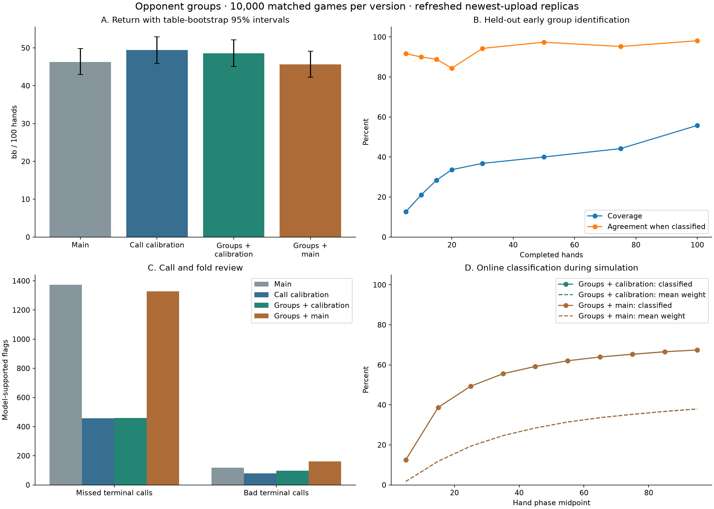

# Opponent groups — 4 October 2026

The held-out study ran **10,000 games per version**, or **4,000,000 hands**, against 69 refreshed opponent replicas. Adding grouping to call calibration changed chip return by **-0.82 [-2.03, +0.45] bb/100**; adding grouping to main changed it by **-0.64 [-1.77, +0.52] bb/100**.

The primary interval does not establish an improvement over call calibration in this replica field.

Keep these grouping variants experimental; the point estimates alone do not justify replacing the baseline.

| Metric | Main | Call calibration | Groups + calibration | Groups + main |
| --- | ---: | ---: | ---: | ---: |
| Net chips | 925,584 | 988,018 | 971,601 | 912,784 |
| bb/100 [95% paired-table bootstrap interval] | +46.28 [+42.94, +49.81] | +49.40 [+45.89, +52.89] | +48.58 [+45.07, +52.16] | +45.64 [+42.24, +49.16] |
| Mean duplicate-table placement points | 3.531 | 3.566 | 3.551 | 3.517 |
| Outright first in duplicate table | 24.04% | 25.34% | 25.19% | 25.73% |
| Folds per hand | 83.59% | 83.55% | 83.51% | 83.52% |
| Flagged folds / all folds | 0.164% | 0.055% | 0.055% | 0.159% |
| Missed-call flags / terminal folds | 7.48% | 2.55% | 2.55% | 7.25% |
| Bad-call flags / terminal calls | 0.64% | 0.42% | 0.51% | 0.86% |
| Negative games | 3,991 | 3,959 | 3,975 | 4,015 |
| Probable missed terminal calls | 1,373 | 458 | 459 | 1,329 |
| Probable bad terminal calls | 118 | 80 | 98 | 162 |
| Provably avoidable folds | 0 | 0 | 0 | 1 |
| Player failures | 0 | 0 | 0 | 0 |

Identical opponent tables, seat rotations and decks were used for all four policies. Bootstrap resampling keeps each of the 2,009 complete duplicate tables together. Chip return weights games equally; placement points weight complete duplicate tables equally. Grouping versus calibration was the original primary comparison. The user requested grouping on main after the three-policy run started; that variant uses the same frozen settings and final seed without further tuning. The additional comparisons are descriptive, with individual 95% intervals rather than a familywise claim. Timed sampling can differ between runs and hardware. These are replica simulations, not live tournament results.

Return intervals condition on this one refitted opponent field. They capture table/deal sampling variation, but do not propagate opponent-parameter uncertainty or errors in recovering the real bots. Fitted variances reduce counter strength; the simulation does not draw a new parameter set from each opponent's bootstrap distribution.

With grouping on both bases, the calibration-based bot differs from the main-based bot by **+2.94 [+1.73, +4.15] bb/100**. The difference between the two grouping improvements is **-0.18 [-1.32, +0.95] bb/100**. Without grouping, call calibration differs from main by **+3.12 [+1.86, +4.37] bb/100**.

| Placement-point change [95% paired-table interval] | Change |
| --- | ---: |
| Grouping added to calibration | -0.015 [-0.050, +0.021] |
| Grouping added to main | -0.013 [-0.050, +0.024] |
| Calibration base versus main base, both grouped | +0.033 [+0.003, +0.065] |

| Seats | Complete tables | Grouping gain on calibration, bb/100 [95% interval] | Grouping gain on main, bb/100 [95% interval] |
| ---: | ---: | ---: | ---: |
| 4 | 517 | -2.56 [-5.34, +0.31] | -0.60 [-3.47, +2.17] |
| 5 | 1020 | -0.86 [-2.64, +0.89] | -1.95 [-3.58, -0.34] |
| 6 | 472 | +0.52 [-1.59, +2.65] | +1.70 [-0.36, +3.73] |

| Hands within game | Main bb/100 | Calibration bb/100 | Groups + calibration bb/100 | Groups + main bb/100 |
| --- | ---: | ---: | ---: | ---: |
| 1–25 | +46.77 | +50.79 | +50.57 | +47.00 |
| 26–50 | +48.75 | +50.97 | +50.36 | +46.24 |
| 51–75 | +45.66 | +47.53 | +45.98 | +45.67 |
| 76–100 | +43.94 | +48.32 | +47.41 | +43.64 |

These subgroup and phase summaries are descriptive. Later hands also have different histories and action paths; a late gain alone would not prove that classification caused it.

The previous call-calibration study reported main at 36.0671 and calibration at 37.76845 bb/100, a paired change of +1.70135 [+0.77688, +2.67168]. That study used 61 opponents; this refit uses 69. Raw returns across the two studies are not controlled comparisons. [Previous committed report](https://github.com/halliday-poker/halliday2/blob/e186308ade4a05778d68a82b9fd636adb46e999b/analysis/reports/call-calibration-20261004.md).

## Strategy

The calibration-based variant retains the terminal-call corrections and 0.06 river margin from call calibration. The main-based variant disables both terminal-call corrections and restores main's 0.02 tracked-range river margin. Its group river-margin targets shift by the same -0.04, preserving identical counter adjustments relative to each base. A compact beta-binomial classifier observes completed public hands, uses table-size-specific distributions, and assigns probabilities to behavioral groups. Group variance and sparse-fit uncertainty reduce the strength of the counter. Unknown opponents retain the baseline strategy. No opponent names, external model files, network calls or GPU are used by the submitted bot.

Counter targets are bounded heuristics derived from the recovered styles. The pilot selects their overall strength; it does not establish that each target is an optimal exploit. The baseline already learns individual opponent ranges, so a coarse group prior can add little information or conflict with that existing adaptation. These are plausible explanations for limited gains, not an identified causal attribution. The final comparison tests the complete grouping package; separating range priors, bet sizing and private variation would require further ablations on a new evaluation seed.

| Group | Reliable training identities | Counter targets on calibration base |
| --- | ---: | --- |
| selective_passive_1 | 29 | Bluff frequency target 0.73; tracked bluff floor 0.34; river call margin 0.058; late bet size 0.99 pot. |
| active_pressure_2 | 32 | Bluff frequency target 0.87; tracked bluff floor 0.38; river call margin 0.049; late bet size 0.96 pot. |

Every target is blended with baseline settings according to classification confidence. Aggression alone is not treated as proof of bluffing. Showdown features use only legally revealed cards. A fitted adaptive trait and supported changes in conditional frequencies permit small private sizing variation, with the same distribution for value bets and bluffs. Random variation never changes call/fold thresholds or the decision to value-bet a strong hand.

The separate 600-game-per-variant pilot chose `snapshots/opponent_groups_full` by the predeclared total-chip rule. Pilot totals: {'0': 58319, '1': 63444, '2': 64599, '3': 60019, '4': 62748}. Range-only adaptation was an ablation, not a replacement for the requested group counters. The final seed was held out from this selection. The main-based grouping variant uses that same selected strength; it was not retuned.

## Early identification

Groups and likelihoods were fitted on training games; group count, temperature and threshold were selected using validation prefixes at hands 5, 10 and 20. The table below measures agreement with training-derived behavioral labels on held-out newest-version games at four-to-six-seat tables. Labels are not recovered source-code identities. Development examined archive diagnostics; this is not an untouched external validation set. Runtime priors were then refitted using all available newest observations.

| Hands observed | Held-out opponent games | Start blending | Agreement among classified |
| --- | ---: | ---: | ---: |
| 5 | 95 | 12.6% | 91.7% |
| 10 | 95 | 21.1% | 90.0% |
| 20 | 95 | 33.7% | 84.4% |
| 50 | 95 | 40.0% | 97.4% |
| 100 | 95 | 55.8% | 98.1% |

Small early samples and ambiguous styles remain unclassified. Identification is per game: the tournament starts a fresh process for each game, so memory cannot carry across a whole round. The runtime trace audit confirms the classifier remained active throughout every candidate decision.

## Refitted field and uncertainty

The frozen input contains 2,647,907 records, 2,654 replays and 2,664 metadata matches; 10 metadata matches lack a replay. All 347,616 newest-version action rows were retained, including upload validation games. Every trusted validation against house:call starts a new version regardless of verdict.

Older observations contribute only to sparse contexts, at maximum weight `0.1 ** version_age * 2 ** (-upload_gap_hours / 6)`, capped at each parameter's support target. 121/690 parameter estimates remain below target. Parameter uncertainty uses 300 whole-match bootstrap draws stratified by version; the files retain covariance and between-game variation as well as point estimates. The parameter CSV covers the 69 opponents; the underlying fit also retains Halliday as an archive identity, excluded from the simulated field. These quantify uncertainty within the replica model, not all possible changes in a new submission.

Newest submissions without replays: Pookie Bot, jongwon. Those opponents use discounted historical priors and remain explicitly uncertain. The classifier models the broader archive and conditions on table size; restricting training to four-to-six seats would omit most identities.

## Weaknesses and decision review

**Groups + calibration:** 459 probable missed terminal calls, 98 probable bad terminal calls; 210 of 3,975 negative games contain a flagged action.

**Groups + main:** 1,329 probable missed terminal calls, 162 probable bad terminal calls; 481 of 4,015 negative games contain a flagged action.

Adding groups to calibration changed probable missed calls from 458 to 459, and probable bad calls from 80 to 98. On main, missed calls changed from 1,373 to 1,329, while bad calls changed from 118 to 162. The grouped versions still miss preflop opportunities, and river calls account for most bad-call flags. These counts favor targeted range/river reviews over indiscriminately reducing the overall fold rate; changed action paths prevent a causal interpretation of the count differences.

A losing game is not itself proof of a blunder. Every simulated hand was reconstructed to verify legality, payouts and zero-sum chips.

Terminal call/fold flags require agreement across tight/loose public-range models and applicable shover sensitivity, after a Monte Carlo margin and a 2-chip threshold. A terminal call ends further betting: normally a closing river call or an all-in closure. A terminal fold declines that opportunity. These are model-based review candidates, not known optimal-action labels; there is no correction for multiple decision-level tests. Changed policies encounter different later decisions. The flagged-fold percentage is the share detected by this audit, not the true frequency of all unnecessary folds.

| Variant | Street | Missed terminal calls | Bad terminal calls |
| --- | --- | ---: | ---: |
| Groups + calibration | preflop | 366 | 1 |
| Groups + calibration | flop | 26 | 3 |
| Groups + calibration | turn | 8 | 9 |
| Groups + calibration | river | 59 | 85 |
| Groups + main | preflop | 1,266 | 0 |
| Groups + main | flop | 24 | 6 |
| Groups + main | turn | 9 | 8 |
| Groups + main | river | 30 | 148 |

| Bot estimate at flagged decision | Groups + calibration | Groups + main |
| --- | ---: | ---: |
| no accepted equity estimate | 9 | 7 |
| accepted conservative sparse estimate | 7 | 0 |
| tracked range estimate | 534 | 1,478 |
| uniform range estimate | 7 | 7 |

These diagnostics help distinguish missing equity, conservative sampling bounds and disagreement between the bot's range model and the audit. They are review contexts, not a proven causal decomposition of the losses.

A guaranteed-profitable call was missed by **Groups + main** at `t001974-g0-c3:13:14`: hole cards `['Ah', '7h']`, board `['8h', '4d', '9h', 'Kh', 'Qs']`, call 62 into a 145-chip pot. The audit's call EV was +145.0 chips. The bot had 2 samples, stopped for `time_budget`, and accepted no equity estimate. This is a concrete fallback weakness: a deterministic check for guaranteed winners can avoid surrendering a known profitable call when sampling fails.

The following ledger includes only games ending with negative chips. Categories classify losing hands; the final row retains profitable hands in those games. A category's chips are realized results, not an estimate of how many chips a strategy change would recover. Failed bluffs and lost all-ins can be correct decisions.

| Hand category in negative games | Groups + calibration: hands / chips | Groups + main: hands / chips |
| --- | ---: | ---: |
| other showdown loss | 5,220 / -436,717 | 5,618 / -473,140 |
| other losing allin | 1,384 / -276,800 | 1,242 / -248,400 |
| profitable allin lost runout | 1,183 / -236,600 | 1,027 / -205,400 |
| postflop invest then fold | 19,475 / -228,205 | 19,336 / -216,242 |
| blind only fold | 114,215 / -168,305 | 115,387 / -170,068 |
| preflop invest then fold | 11,926 / -68,894 | 12,136 / -70,756 |
| failed air bet hand | 1,349 / -68,582 | 1,375 / -68,952 |
| failed semibluff hand | 779 / -43,560 | 795 / -44,901 |
| probable bad terminal call | 41 / -5,415 | 75 / -9,933 |
| probable missed terminal call | 173 / -3,751 | 489 / -5,665 |
| non losing hand | 241,755 / +840,416 | 244,020 / +815,644 |

High-impact review examples below are ranked by the conservative public-model EV bound. The EV bounds compare a terminal call with folding at that decision, not the realized cost of the entire hand. Full cards, state and classifications are in the blunder CSV.

| Variant | Decision | Street / action | Classification | Public EV interval, chips | Game chips |
| --- | --- | --- | --- | ---: | ---: |
| Groups + calibration | `t000432-g4-c2:94:15` | river / fold | probable_missed_terminal_call | [+314.1, +321.8] | -501 |
| Groups + calibration | `t001085-g0-c2:41:9` | flop / fold | probable_missed_terminal_call | [+257.1, +269.7] | +21 |
| Groups + calibration | `t000275-g5-c2:16:7` | preflop / fold | probable_missed_terminal_call | [+197.1, +209.8] | +391 |
| Groups + calibration | `t001745-g3-c2:80:13` | turn / fold | probable_missed_terminal_call | [+161.0, +331.6] | +131 |
| Groups + calibration | `t000890-g3-c2:85:10` | river / call | probable_bad_terminal_call | [-141.2, -98.8] | +404 |
| Groups + main | `t000369-g2-c3:71:11` | turn / fold | probable_missed_terminal_call | [+152.5, +161.0] | +121 |
| Groups + main | `t001974-g0-c3:13:14` | river / fold | certain_avoidable_fold | [+145.0, +145.0] | +528 |
| Groups + main | `t001006-g0-c3:92:6` | preflop / fold | probable_missed_terminal_call | [+136.1, +188.7] | +1,505 |
| Groups + main | `t000687-g4-c3:93:5` | preflop / fold | probable_missed_terminal_call | [+120.9, +185.1] | +964 |
| Groups + main | `t000689-g4-c3:13:5` | preflop / fold | probable_missed_terminal_call | [+117.2, +191.7] | +440 |

## SWOT

- **Strengths:** compact public-event inference, uncertainty-weighted counters, retained call fixes in the calibrated variant, and measured resource compliance.
- **Weaknesses:** broad groups hide variation within a style; early classification covers only part of the field. Cumulative group evidence can react slowly to mid-game changes. Bluff and adaptation estimates remain indirect.
- **Opportunities:** collect more recent games at tournament table sizes, review high-cost call/fold cases, test evidence-driven forgetting after supported drift, and test finer groups only when early identification supports them.
- **Threats:** new uploads, strategic deception, sparse priors, and replica mismatch can invalidate the learned group signatures. No four-round regrouping or podium probability is simulated.

## Compute and reproduction

Main `6cfdf0f44b332933d88d440791e7151028061849`; call calibration `e186308ade4a05778d68a82b9fd636adb46e999b`. The selected backend used 16 cpu workers after matched throughput benchmarks. The simulation stages took 76.9 minutes, including resumed-trace loading. All four V100s performed fitting and the separate decision audit. GPU batching was checked against main's CPU math on 48 fixed-sample cases.

Both grouped variants passed restricted subprocess games with one CPU, a 512 MiB address-space limit, read-only filesystems and a private network namespace. Maximum measured RSS was 39.2 MiB. Tests, smoke results, source hashes, model manifests and device work counters accompany the report.

Input SHA-256: `0d095948334a0464ddc27e138feb8c3ea5fcf5964cc965636187518f9951e44c`.

[Reproduction commands](opponent-groups-20261004-reproduce.md) · [Paired tables](opponent-groups-20261004-tables.csv) · [Game reviews](opponent-groups-20261004-games.csv) · [Blunder cases](opponent-groups-20261004-blunders.csv) · [Classification checks](opponent-groups-20261004-classification.csv) · [Parameters](opponent-groups-20261004-parameters.csv)
