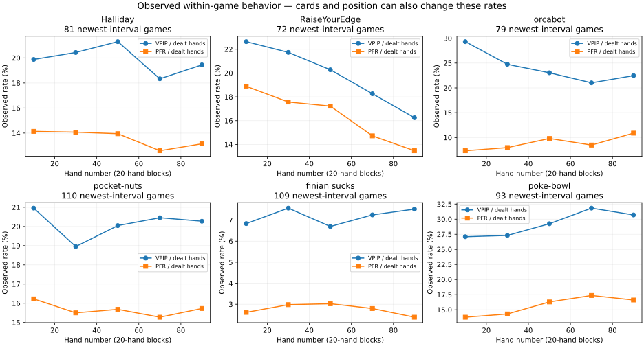

# Within-game parameter changes — 20261004-r3

Refit the newest observed intervals from 2,230 replay matches (2,180,812 records). Actions SHA-256: `7c86b5ce5ff8636f4a3ebdbacdc51d24c35c12fa571842092016c935f7daa2a2`. The complete static parameter table covers every observed identity; the temporal study has 66 reliably dated ladder identities, 819 distinct matches, 314,300 bot-hands and 436,281 decisions. Bot-hands count each participating analyzed bot separately.

## What the new features explain

The validation-selected model is **history**. On 83,835 held-out decisions in 162 whole matches, its action log-loss change versus the equally trained static-context model is -0.000604 (positive means improvement). Its Brier error changes from 0.153918 to 0.153589: a +0.214% reduction. This is residual prediction error, not a fraction of recovered strategy variance.

**The clearer gain is bet sizing.** The selected history model reduces squared raise-target error from 336.31 to 299.56 chips², a **10.93% reduction** on held-out raises. The progress-only model reduces mean absolute sizing error from 5.674 to 5.428 chips (**4.34%**). These quantify reduced unexplained prediction error, not recovered code parameters.

No bots have positive conditional prediction gains surviving the prespecified bot-level false-discovery correction. 2 bots show at least one corrected early-to-late raw VPIP/PFR/fold-rate trend. Raw trends may reflect cards, position and betting opportunities; the two types of evidence must not be conflated.

| Model | Action log loss ↓ | Brier ↓ | Accuracy | Raise target MAE, chips ↓ | Raise target MSE, chips² ↓ |
|---|---:|---:|---:|---:|---:|
| static | 0.258036 | 0.153918 | 89.10% | 5.674 | 336.31 |
| progress | 0.259261 | 0.154237 | 89.11% | 5.428 | 323.85 |
| history | 0.258640 | 0.153589 | 89.29% | 5.555 | 299.56 |
| combined | 0.260411 | 0.155160 | 89.12% | 5.457 | 300.50 |

All four networks have identical dimensions, initialization, optimizer, seed, match partitions and latest-interval training data. Removed feature groups are zeroed. Static context already includes own cards, board, position, pot odds, betting history, stack/legal constraints and coarse observed-opponent aggression/folding flags.

| Added information | Mean per-match NLL gain, 95% interval | Three-comparison-adjusted interval |
|---|---:|---:|
| progress | -0.0016 [-0.0042, +0.0010] | [-0.005, +0.002] |
| history | +0.0001 [-0.0039, +0.0037] | [-0.005, +0.004] |
| combined | -0.0026 [-0.0054, +0.0003] | [-0.006, +0.001] |

Sizing diagnostics use only observed raises and the same untouched test matches. Each metric compares the three added-feature models with static context; intervals below adjust for those three comparisons. Model choice remains validation-only.

| Model | Per-match absolute-error reduction, adjusted interval (chips) | Per-match squared-error reduction, adjusted interval (chips²) |
|---|---:|---:|
| progress | +0.193 [+0.024, +0.354] | +7.021 [-16.609, +28.063] |
| history | +0.174 [-0.060, +0.511] | +41.974 [+6.633, +94.691] |
| combined | +0.211 [+0.013, +0.458] | +38.184 [+9.249, +76.119] |

The table above gives equal weight to each held-out match; the first metric table weights decisions equally. Intervals resample whole matches, preserving the dependence among actions and bots at a table. These intervals exclude model misspecification. The model-selection objective also includes sizing-bin log loss, so validation selection need not coincide with the lowest test action log loss.

## Patterns and possible explanations

A parameter estimate moving between two windows is not evidence that source-code constants changed. Different cards, legal opportunities, player positions, opponent actions and sparse data can change the best-fitting surrogate. The `adaptive` flag selects a scaffold likelihood, not a verified adaptation mechanism.

VPIP is the fraction of dealt hands with a voluntary preflop call or raise; PFR is the fraction with a preflop raise. Fold rates here count hands ending in the bot folding, divided by all dealt hands, including walks. Early and late refer to hands 1–20 and 81–100.

| Bot | Latest games | Early → late VPIP | Conditional NLL gain / game | Explanation |
|---|---:|---:|---:|---|
| Halliday | 81 | 19.9% → 19.4% | -0.0235 [-0.0387, -0.0081] | conditional improvement not established after multiple-testing correction |
| RaiseYourEdge | 72 | 22.6% → 16.2% | -0.0012 [-0.0195, +0.0169] | vpip -6.4 percentage points late versus early (raw behavior); pfr -5.4 percentage points late versus early (raw behavior); fold +5.3 percentage points late versus early (raw behavior); conditional improvement not established after multiple-testing correction |
| orcabot | 79 | 29.3% → 22.5% | -0.0086 [-0.0217, +0.0051] | vpip -6.8 percentage points late versus early (raw behavior); pfr +3.5 percentage points late versus early (raw behavior); conditional improvement not established after multiple-testing correction |

**RaiseYourEdge: progressively less participation.** VPIP falls from 22.64% to 16.25%, PFR from 18.89% to 13.47%, and folding rises from 86.04% to 91.39%. Its observed VPIP declines across all five phases. This fits a tightening pattern. The data do not identify whether a hand-count schedule, opponent adaptation, score protection or time budget causes it. The pooled fitted size setting also drops, but its paired uncertainty interval includes zero; that point estimate alone does not prove a sizing switch.

**orcabot: less passive entry, more selective raising.** VPIP falls from 29.30% to 22.47% while PFR rises from 7.34% to 10.89%. Calling an unraised preflop price falls from 199/744 (26.75%) to 87/722 (12.05%). This explains how it can play fewer hands yet raise more often. The fitted limp setting falls from 0.80 to 0.65. A shift away from early limping is a plausible behavioral description; the underlying mechanism remains unverified.



The history model uses only preceding public information: accumulated chips and relative standing; the previous result, last-five-hand result and loss streak; and smoothed own/opponent VPIP, PFR, preflop shoves and fold share. It cannot diagnose tilt, intent or a particular internal learning algorithm.

Conditional feature shuffling stays within the same bot, street and 20-hand phase. Positive increases below mean the selected model uses that information. Correlated predictors and unrealistic shuffled combinations mean these are sensitivity diagnostics, not causal explanations or additional validated performance gains.

| Shuffled feature group | Test log-loss increase | Raise-target MSE increase, chips² |
|---|---:|---:|
| public_score | +0.002174 | +32.661 |
| recent_results | +0.000247 | -0.666 |
| observed_frequencies | +0.004380 | +7.552 |

The largest sizing sensitivity is **public_score**, with a +32.66 chips² error increase when shuffled. This identifies information used by the fitted model; it does not establish that each bot explicitly implements that mechanism.

Shuffling recent results does not worsen sizing error. This diagnostic provides no clear sizing evidence for a reaction to recent losses or a tilt mechanism.

## Halliday specifically

The newest observed Halliday interval contains 81 games. Observed VPIP changes from 19.88% in hands 1–20 to 19.44% in hands 81–100. Its conditional prediction result is -0.0235 [-0.0387, -0.0081]; corrected q=0.3868. Conditional improvement not established after multiple-testing correction.

| Surrogate setting | First 20 hands | Last 20 hands | Paired late-minus-early bootstrap interval |
|---|---:|---:|---:|
| vpip | 0.180 | 0.160 | [-0.070, +0.060] |
| pfr | 0.180 | 0.160 | [-0.070, +0.060] |
| threebet | 0.030 | 0.040 | [-0.010, +0.020] |
| limp | 0.150 | 0.100 | [-0.150, +0.100] |
| aggression | 0.200 | 0.300 | [-0.300, +0.500] |
| cbet | 0.650 | 0.650 | [-0.226, +0.200] |
| bluff | 0.650 | 0.600 | [-0.400, +0.300] |
| stickiness | 0.910 | 0.390 | [-0.640, +0.116] |
| size | 0.910 | 0.895 | [-0.040, +0.013] |
| adaptive | 0.000 | 0.000 | [+0.000, +1.000] |

All ten early-to-late parameter intervals include zero. These fits do not establish a reliable Halliday strategy shift within a game.

These parameter intervals are descriptive, conditional on the surrogate and its grid. In particular, a large point movement with an interval spanning zero does not establish a leak or justify a scheduled parameter change.

## Every analyzed bot

| Bot | Games | Test games | Conditional NLL gain, 95% interval | Corrected q | Finding |
|---|---:|---:|---|---:|---|
| Allen Iverson | 14 | 3 | -0.0020 [-0.0172, +0.0279] | 1.0000 | too few test games for a bot-specific conditional conclusion |
| Allen Iverson 2.0 | 72 | 11 | +0.0113 [+0.0015, +0.0233] | 0.4975 | conditional improvement not established after multiple-testing correction |
| Althaf Productions v1 | 79 | 18 | -0.0057 [-0.0176, +0.0051] | 1.0000 | conditional improvement not established after multiple-testing correction |
| BigBaller | 20 | 3 | -0.0071 [-0.0347, +0.0343] | 1.0000 | too few test games for a bot-specific conditional conclusion |
| Gladiator | 8 | 1 | insufficient games | 1.0000 | too few test games for a bot-specific conditional conclusion |
| Gladiator_v3 | 15 | 4 | -0.0274 [-0.0428, -0.0172] | 1.0000 | too few test games for a bot-specific conditional conclusion |
| Gladiators | 77 | 11 | -0.0366 [-0.0473, -0.0257] | 0.1518 | conditional improvement not established after multiple-testing correction |
| Halliday | 81 | 13 | -0.0235 [-0.0387, -0.0081] | 0.3868 | conditional improvement not established after multiple-testing correction |
| Invoker | 1 | 0 | insufficient games | 1.0000 | too few test games for a bot-specific conditional conclusion |
| Invokerv2 | 15 | 2 | +0.0812 [+0.0807, +0.0816] | 1.0000 | too few test games for a bot-specific conditional conclusion |
| Jason_idea | 1 | 0 | insufficient games | 1.0000 | too few test games for a bot-specific conditional conclusion |
| LF5 | 10 | 3 | +0.0121 [-0.0198, +0.0287] | 1.0000 | too few test games for a bot-specific conditional conclusion |
| MAC Projects Team | 10 | 2 | +0.0056 [-0.0005, +0.0116] | 1.0000 | too few test games for a bot-specific conditional conclusion |
| MAC Projects Team Testing Bot | 51 | 8 | -0.0070 [-0.0258, +0.0132] | 1.0000 | conditional improvement not established after multiple-testing correction |
| MAC Projects Team Testing Bot 2 | 63 | 10 | +0.0461 [-0.0019, +0.1270] | 0.9628 | conditional improvement not established after multiple-testing correction |
| MAC Projects Team Testing Bot 3 | 72 | 11 | +0.0430 [+0.0069, +0.0883] | 0.4975 | conditional improvement not established after multiple-testing correction |
| McSmart Meal | 79 | 19 | +0.0089 [-0.0009, +0.0194] | 0.7141 | conditional improvement not established after multiple-testing correction |
| Messi | 87 | 11 | -0.0004 [-0.0080, +0.0066] | 1.0000 | conditional improvement not established after multiple-testing correction |
| Phil_Ivey_GOAT | 35 | 7 | +0.0006 [-0.0124, +0.0109] | 1.0000 | too few test games for a bot-specific conditional conclusion |
| RaiseYourEdge | 72 | 13 | -0.0012 [-0.0195, +0.0169] | 1.0000 | vpip -6.4 percentage points late versus early (raw behavior); pfr -5.4 percentage points late versus early (raw behavior); fold +5.3 percentage points late versus early (raw behavior); conditional improvement not established after multiple-testing correction |
| RiverForge | 73 | 17 | -0.0091 [-0.0225, +0.0044] | 0.9628 | conditional improvement not established after multiple-testing correction |
| Sus bot | 76 | 12 | +0.0000 [-0.0126, +0.0124] | 1.0000 | conditional improvement not established after multiple-testing correction |
| Tester67 | 84 | 14 | +0.0161 [-0.0015, +0.0328] | 0.6417 | conditional improvement not established after multiple-testing correction |
| Thanos | 18 | 3 | -0.0332 [-0.0699, +0.0083] | 1.0000 | too few test games for a bot-specific conditional conclusion |
| Tilted_Towers_2 | 70 | 17 | -0.0014 [-0.0107, +0.0080] | 1.0000 | conditional improvement not established after multiple-testing correction |
| Tilted_towers_1 | 12 | 2 | -0.0087 [-0.0263, +0.0089] | 1.0000 | too few test games for a bot-specific conditional conclusion |
| axiom | 37 | 6 | -0.0064 [-0.0192, +0.0037] | 1.0000 | too few test games for a bot-specific conditional conclusion |
| best-bot | 77 | 14 | -0.0012 [-0.0160, +0.0132] | 1.0000 | conditional improvement not established after multiple-testing correction |
| big dog | 2 | 0 | insufficient games | 1.0000 | too few test games for a bot-specific conditional conclusion |
| catherine | 78 | 13 | -0.0030 [-0.0131, +0.0064] | 1.0000 | conditional improvement not established after multiple-testing correction |
| dan_negreanu_on_ket | 16 | 3 | -0.0474 [-0.0714, -0.0293] | 1.0000 | too few test games for a bot-specific conditional conclusion |
| data | 3 | 2 | +0.0267 [+0.0159, +0.0375] | 1.0000 | too few test games for a bot-specific conditional conclusion |
| finian sucks | 109 | 30 | -0.0128 [-0.0300, -0.0013] | 0.4975 | conditional improvement not established after multiple-testing correction |
| fold-a2 | 20 | 3 | +0.0112 [-0.0271, +0.0506] | 1.0000 | too few test games for a bot-specific conditional conclusion |
| fullhouse | 21 | 4 | +0.0153 [+0.0128, +0.0185] | 1.0000 | too few test games for a bot-specific conditional conclusion |
| guaguanco 5 | 70 | 13 | -0.0017 [-0.0189, +0.0154] | 1.0000 | conditional improvement not established after multiple-testing correction |
| idc | 72 | 10 | +0.0035 [-0.0062, +0.0149] | 1.0000 | conditional improvement not established after multiple-testing correction |
| jongwon | 4 | 1 | insufficient games | 1.0000 | too few test games for a bot-specific conditional conclusion |
| kurimanju | 77 | 16 | -0.0123 [-0.0221, -0.0028] | 0.3868 | conditional improvement not established after multiple-testing correction |
| larp larp sahur | 71 | 18 | +0.0099 [+0.0019, +0.0177] | 0.3868 | conditional improvement not established after multiple-testing correction |
| let it go | 32 | 7 | +0.0013 [-0.0069, +0.0102] | 1.0000 | too few test games for a bot-specific conditional conclusion |
| love-of-da-game | 70 | 13 | +0.0002 [-0.0129, +0.0136] | 1.0000 | conditional improvement not established after multiple-testing correction |
| luck is all u need | 75 | 16 | -0.0077 [-0.0138, -0.0014] | 0.3868 | conditional improvement not established after multiple-testing correction |
| merch where | 1 | 1 | insufficient games | 1.0000 | too few test games for a bot-specific conditional conclusion |
| netanyahu | 76 | 12 | -0.0014 [-0.0152, +0.0152] | 1.0000 | conditional improvement not established after multiple-testing correction |
| orcabot | 79 | 13 | -0.0086 [-0.0217, +0.0051] | 0.9628 | vpip -6.8 percentage points late versus early (raw behavior); pfr +3.5 percentage points late versus early (raw behavior); conditional improvement not established after multiple-testing correction |
| percy-perc-filet | 56 | 13 | -0.0028 [-0.0106, +0.0057] | 1.0000 | conditional improvement not established after multiple-testing correction |
| pocket-nuts | 110 | 29 | -0.0037 [-0.0131, +0.0051] | 1.0000 | conditional improvement not established after multiple-testing correction |
| poke-bowl | 93 | 24 | +0.0000 [-0.0104, +0.0092] | 1.0000 | conditional improvement not established after multiple-testing correction |
| polygamous lavender marriage | 68 | 17 | +0.0090 [-0.0101, +0.0329] | 1.0000 | conditional improvement not established after multiple-testing correction |
| preflop-warrior | 55 | 12 | +0.0069 [-0.0066, +0.0216] | 1.0000 | conditional improvement not established after multiple-testing correction |
| pressure | 40 | 7 | -0.0035 [-0.0194, +0.0107] | 1.0000 | too few test games for a bot-specific conditional conclusion |
| radishv1 | 11 | 2 | -0.0275 [-0.0528, -0.0022] | 1.0000 | too few test games for a bot-specific conditional conclusion |
| radishv2 | 76 | 11 | -0.0049 [-0.0159, +0.0052] | 1.0000 | conditional improvement not established after multiple-testing correction |
| renbot | 10 | 0 | insufficient games | 1.0000 | too few test games for a bot-specific conditional conclusion |
| samith pai is lowkey leng | 4 | 0 | insufficient games | 1.0000 | too few test games for a bot-specific conditional conclusion |
| testQ | 4 | 0 | insufficient games | 1.0000 | too few test games for a bot-specific conditional conclusion |
| the GOON | 76 | 13 | -0.0052 [-0.0168, +0.0063] | 1.0000 | conditional improvement not established after multiple-testing correction |
| the big dog | 44 | 7 | -0.0001 [-0.0302, +0.0269] | 1.0000 | too few test games for a bot-specific conditional conclusion |
| the notorious | 70 | 16 | +0.0056 [-0.0028, +0.0149] | 1.0000 | conditional improvement not established after multiple-testing correction |
| tripi tropi | 30 | 8 | +0.0089 [-0.0034, +0.0200] | 0.9628 | conditional improvement not established after multiple-testing correction |
| tungbot | 91 | 12 | +0.0108 [-0.0046, +0.0273] | 0.9628 | conditional improvement not established after multiple-testing correction |
| tutududu | 51 | 13 | +0.0098 [-0.0041, +0.0238] | 0.9628 | conditional improvement not established after multiple-testing correction |
| wicked wings combo | 7 | 3 | +0.0207 [+0.0058, +0.0323] | 1.0000 | too few test games for a bot-specific conditional conclusion |
| yep | 8 | 0 | insufficient games | 1.0000 | too few test games for a bot-specific conditional conclusion |
| zinger box | 54 | 7 | -0.0032 [-0.0194, +0.0144] | 1.0000 | too few test games for a bot-specific conditional conclusion |

## Exclusions and limits

Each analyzed bot contributes only its newest trusted observed upload interval. Other players at those tables can belong to the versions actually encountered; this is not the stricter all-seats-latest performance cohort. Shared opponent reconstruction is refitted from the full dataset, but the four temporal comparison models train only on this latest-interval cohort. Whole matches share a deterministic 60/20/20 split across all bots.

Successful validation proves an upload, not its deployment. Display names cannot resolve every rename. Unknown-time games are excluded from this temporal study, including unknown-time games sharing a base epoch with dated games. Validation-only and house identities are excluded. Their available static estimates remain in the full parameter CSV with the limitation marked.

The static catalogue preserves the reconstruction workflow, whose shared base epochs can mix dated and undated observations. Those rows are explicitly marked in the static CSV. The per-game and pooled-phase CSVs apply the stricter trusted-time filter throughout.

| Excluded identity | Reason |
|---|---|
| Artificial Incompetence | No trusted play time; newest submission cannot be assigned |
| Nice Hand, Sir | No trusted play time; newest submission cannot be assigned |
| Who me? | No trusted play time; newest submission cannot be assigned |
| alo | No trusted play time; newest submission cannot be assigned |
| biji satu | No trusted play time; newest submission cannot be assigned |
| diddy blud | No trusted play time; newest submission cannot be assigned |
| dudududu | No trusted play time; newest submission cannot be assigned |
| elaine | No trusted play time; newest submission cannot be assigned |
| fufufafa | No trusted play time; newest submission cannot be assigned |
| goatbot | No trusted play time; newest submission cannot be assigned |
| guaguanco | No trusted play time; newest submission cannot be assigned |
| guaguanco 2 | House or validation-only identity |
| guaguanco 3 | No trusted play time; newest submission cannot be assigned |
| guaguanco 4 | No trusted play time; newest submission cannot be assigned |
| house:call | House or validation-only identity |
| kingfisher | No trusted play time; newest submission cannot be assigned |
| lil-fruit | No trusted play time; newest submission cannot be assigned |
| lil-fruit 2.2 | No trusted play time; newest submission cannot be assigned |
| lil-fruit x | No trusted play time; newest submission cannot be assigned |
| poke-bowl-one | No trusted play time; newest submission cannot be assigned |
| radishv0 | No trusted play time; newest submission cannot be assigned |
| scaffold | No trusted play time; newest submission cannot be assigned |
| test1 | No trusted play time; newest submission cannot be assigned |

The original 100-hand match length is used; “rounds” here means successive hands, while betting streets are context controls. Scores reset per match and stacks reset per hand. No timing, verdict or deployed-source trace is available to distinguish time-bank exhaustion from a deliberate late-game policy. The predictor receives neither hidden opponent cards nor any current/future-hand outcome.

## Parameter files and reproduction

- [Newest static parameters for every identity](latest-parameters-20261004-r3.csv).
- [All five 20-hand parameter fits, uncertainty and opportunity counts](within-game-parameters-20261004-r3.csv).
- [Every bot/game/10-hand window](within-game-windows-20261004-r3.csv.gz): gzip CSV with all ten shrunk settings, local opportunity counts and supported raw estimates.
- [Per-bot findings](within-game-patterns-20261004-r3.csv) and [evidence index](evidence/within-game-20261004-r3/index.json).

Ten-hand windows add a pooled prior equivalent to 20 hands from other games of that same newest bot interval. The current game is excluded from its prior. Estimates can be prior-dominated; raw estimates are blank below ten local opportunities. Pooled 20-hand phases use 300 paired whole-match bootstrap draws, retaining each game together across phases. These descriptive fits can use all selected matches; they are not fed into the held-out predictive experiment.

Bot-specific predictive tests require eight test matches, use paired sign permutations and apply Benjamini–Hochberg correction across bots. The saved comparison also checks every bot against all three added-feature models, correcting across that full family; 0 positive action-prediction comparisons survive that broader check. Raw early/late VPIP, PFR and fold trends are a separate family of three tests per bot, with the same minimum of eight matches. Dependence between games, grid-limited estimates and sparse contexts constrain interpretation. Parameter-change bootstrap intervals are not regular hypothesis tests.

The refreshed executable JSON catalogue retains the validated reconstruction workflow. The new time/history predictors and descriptive parameter trajectories are diagnostic artifacts, not an unvalidated runtime replacement.

## Compute and verification

The four temporal models train concurrently on distinct V100 GPUs, one model per device, for 100 epochs. Peak tensor allocation is 150.6 MiB per worker, below the 768 MiB limit. Training takes 12.2–12.7 seconds per model. Window fitting distributes bots across all four GPUs and takes 45.1 seconds. CPU parsing and serialization are separate; NVLink does not pool device memory.

Independent verification reconciles the source hash, trusted newest intervals, every dealt hand and window, final chip totals, whole-match partitions and four distinct training devices. No-action walks remain in all hand denominators.

All **154 regression tests pass** with CUDA enabled and no skips; the evidence bundle includes the test log.

## Reproduction commands

Run from the repository root; frozen inputs and cached validation responses are local and not committed:

```sh
export OMP_NUM_THREADS=1 OPENBLAS_NUM_THREADS=1
analysis_python=.venv-estimators/bin/python
analysis_run=analysis/results/refresh-20261004-r3
$analysis_python -B analysis/run_refresh_models.py --directory "$analysis_run" --epochs 100
$analysis_python -B -m opponent_model.within_game prepare --directory "$analysis_run"
$analysis_python -B -m opponent_model.within_game train --directory "$analysis_run" --devices 0,1,2,3 --epochs 100
$analysis_python -B -m opponent_model.within_game windows --directory "$analysis_run" --devices 0,1,2,3
$analysis_python -B -m opponent_model.within_game explain --directory "$analysis_run" --devices 0
$analysis_python -B analysis/verify_within_game.py --directory "$analysis_run"
$analysis_python -B analysis/report_within_game.py --directory "$analysis_run"
```

For another completed upload, choose an unused run directory and prepare it before running the stages above:

```sh
analysis_run=analysis/results/refresh-YYYYMMDD-rN
$analysis_python -B analysis/freeze_snapshot.py --source analysis/results/input-snapshot --directory "$analysis_run"
$analysis_python -B -m opponent_model.fetch_validation --matches "$analysis_run/source/matches.json" --output "$analysis_run/validation-meta.json"
```

Use the analysis environment described in `opponent_model/README.md`, with `uv pip install --python .venv-estimators/bin/python matplotlib==3.11.2` for plots. Reproducing this study exactly requires its original frozen source and validation responses. Seeds, source SHA-256, devices, model stopping points, checkpoint fingerprints and complete window traces are preserved. The static refresh rebuilds the executable opponent catalogue.
